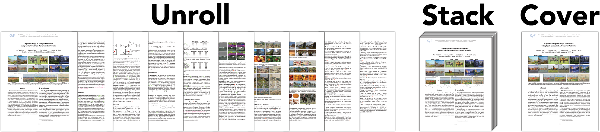

# PDF ➡️ Preview

A simple tool to save me time on Illustrator. Generates a preview image for a PDF file. Useful for sneak peeks to academic publications on project websites or presentation slides.



---

## Try it out!

http://pdf2preview.chuanenlin.com

---

## Setting up

1.  Clone the repository.

```python
git clone https://github.com/chuanenlin/pdf2preview.git
cd pdf2preview
```

2.  Install package dependencies.

```python
pip install -r requirements.txt
```

3.  Run the app.

```python
streamlit run pdf2preview.py
```
