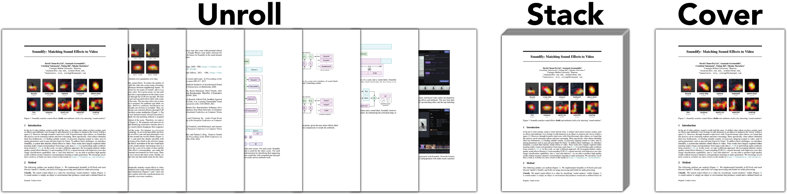

# PDF ➡️ Preview

Generate a preview image for a PDF file — useful for sneak peeks of academic publications on project websites or presentation slides.

Pick a layout (**Unroll**, **Stack**, or **Cover**), drop in a PDF (or paste a link), and download the result as a PNG.



## How it works

Everything runs client-side in the browser — your PDF never leaves your machine:

- [pdf.js](https://mozilla.github.io/pdf.js/) renders each page to a canvas
- The Canvas API adds the border + drop shadow and composites the pages into the chosen layout
- The only server code is a small API route (`app/api/fetch-pdf`) that proxies PDF-by-URL fetches around CORS

Built with [Next.js](https://nextjs.org), [Tailwind CSS](https://tailwindcss.com), and [shadcn/ui](https://ui.shadcn.com).

## Development

```bash
npm install
npm run dev
```

## Deploy

Deploys as-is on [Vercel](https://vercel.com) — import the repo and hit deploy, no configuration needed.

## Legacy

The original Streamlit/PyMuPDF version lives in [`legacy/`](legacy/).

---

By [David Chuan-En Lin](https://chuanenlin.com). PDF URL support by [Eliott Zemour](https://github.com/EliottZemour).
